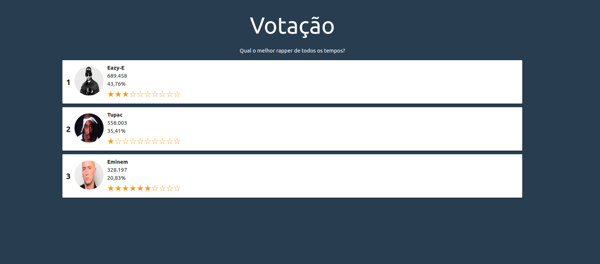

<div align="center">
  <h1>Simulating Votes</h1>
  

  

  
</div>

# About this project
An API with Node.js that simulates a vote, the front-end made in React.js renders the position of the candidates according to the votes, in this project several concepts were used such as monitoring with setInterval, react hooks for state management with useState and effects with useEffect, functional components, props and children among others.

The materialize, react-flip-move and react-countup libraries were also used.

# How to run this project
```bash
  # Clone this repository
  $ git clone https://github.com/jefferson1104/simulatingVotes-reactjs.git
```

### Run back-end (API)
```bash
# Access directory back-end of project
$ cd simulatingVotes-reactjs/backend
$ code . 

# Install all dependencies
$ yarn

# Run this application
$ yarn start

# Open app at http://localhost:8080
```

### Run front-end (WEB)
```bash
# Access directory front-end of project
$ cd simulatingVotes-reactjs/frontend
$ code . 

# Install all dependencies
$ yarn

# Run this application
$ yarn start

# Open app at http://localhost:3000
```
# screenshots 



